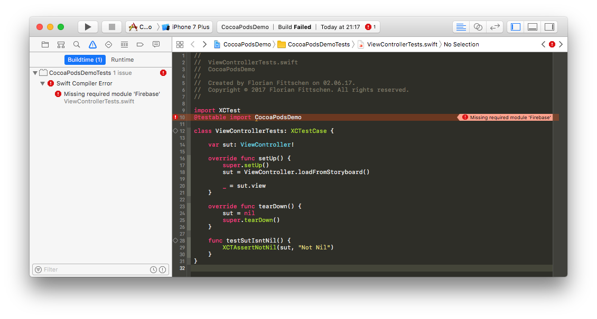

# Sample project to reproduce the 'Missing required module' error
This is a sample project for [CocoaPods](https://github.com/CocoaPods/CocoaPods) issue [#6599](https://github.com/CocoaPods/CocoaPods/issues/6599)

## Steps to reproduce
1. Clone or download this repository
2. Run `bundle exec pod install`
3. Open `CocoaPodsDemo.xcworkspace` and run all tests (e.g. by pressing Cmd+U)

## Expected outcome
Project and Pods build successfully and all tests are green

## Actual outcome
Compiling the unit test target fails with the error message: _Missing required module 'Firebase'_

